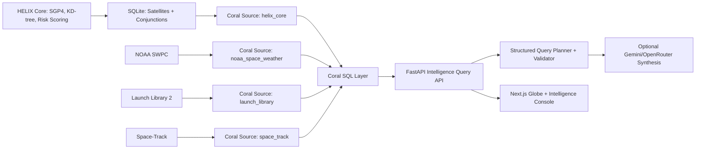

# HELIX Coral Demo Guide

HELIX is now positioned as an AI-powered space operations intelligence
platform. The demo should show that Coral is the data orchestration layer, not
a side badge.

## Architecture



## Three-Minute Flow

1. Open the globe and show HELIX already tracking satellites and conjunctions.
   The key message: the original SSA core is preserved.

2. Open the Intel console and run:

   ```text
   Summarize operational threats for the next 48 hours across conjunctions, weather, and launches.
   ```

   Point out that the planner creates a bounded investigation session and then
   executes approved Coral queries step by step instead of sending arbitrary SQL
   to the backend.

3. Open the returned query chips and rows. Explain that the answer joins local
   conjunctions, NOAA space weather, Launch Library 2, and Space-Track through
   Coral SQL. Use the timeline and relationship map to show the investigation
   path.

4. Run the benchmark button. Use it to show query latency and source health.

5. Run the Starlink prompt:

   ```text
   Which upcoming Starlink launches overlap with local conjunction pressure?
   ```

   This demonstrates launch intelligence correlated against current local
   conjunction activity.

6. Close with the sponsor message: Coral turns a satellite tracker into a
   cross-source operational intelligence system that AI agents can query safely
   and auditably.

## High-Impact Prompts

```text
Summarize operational threats for the next 48 hours across conjunctions, weather, and launches.
```

```text
Show high-risk conjunction context during current NOAA space weather.
```

```text
Which upcoming Starlink launches overlap with local conjunction pressure?
```

```text
Show closest conjunctions with Space-Track object type and country metadata.
```

## Sponsor Feature Showcase

- Multiple sources exposed as Coral tables:
  `helix_core`, `noaa_space_weather`, `launch_library`, `space_track`.
- Cross-source joins:
  conjunction risk plus NOAA scales, launches plus NOAA scales, HELIX objects
  plus Space-Track metadata.
- AI workflow:
  natural language prompt to structured investigation plan, approved query
  chain, visible reasoning trace, conservative recommendations, optional LLM
  synthesis, fallback deterministic synthesis.
- Passive alerts:
  current risk, launch, and weather conditions can surface recommended
  investigations without a background autonomous loop.
- MCP-ready:
  `coral mcp-stdio` is verified and documented without mutating global config.
- Caching and repeatability:
  source snapshots are stored in repo-local `coral/data`, and prompt responses
  are cached briefly in the backend.

## Current Benchmark Snapshot

Captured locally on 2026-05-28:

| Query | Rows | Latency |
| --- | ---: | ---: |
| `risk_weather_context` | 3 | 476.94 ms |
| `closest_spacetrack_enrichment` | 20 | 272.88 ms |
| `starlink_launch_context` | 5 | 777.22 ms |
| `launch_weather_window` | 15 | 174.39 ms |

## Runbook

Start backend:

```bash
cd backend
source venv/bin/activate
uvicorn main:app --reload
```

Start frontend:

```bash
cd frontend
npm run dev
```

Refresh Coral snapshots:

```bash
python3 tools/export_coral_helix_core.py
python3 tools/fetch_noaa_space_weather.py
python3 tools/fetch_launch_library.py --limit 50
python3 tools/fetch_spacetrack.py --limit 1000
```

Validate:

```bash
coral source test helix_core
coral source test noaa_space_weather
coral source test launch_library
coral source test space_track
curl http://127.0.0.1:8000/intelligence/benchmark
```

## Fallback Story

The AI synthesis layer is optional. If Gemini or OpenRouter is unavailable, the
structured planner still returns Coral query results and a deterministic
operations summary. This keeps the demo reliable and reinforces that Coral is
the trusted retrieval layer.
